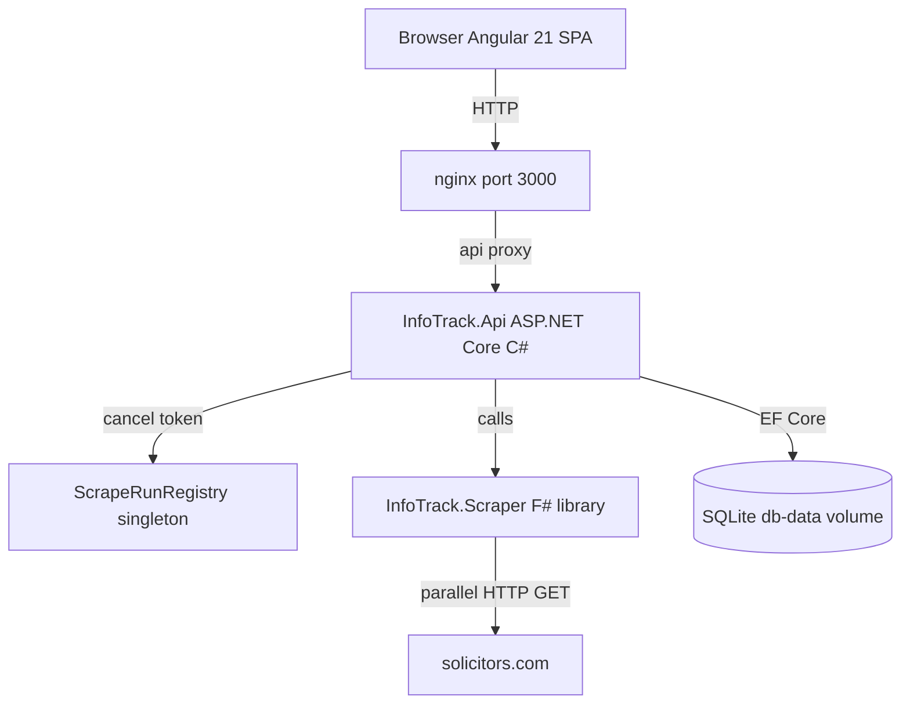
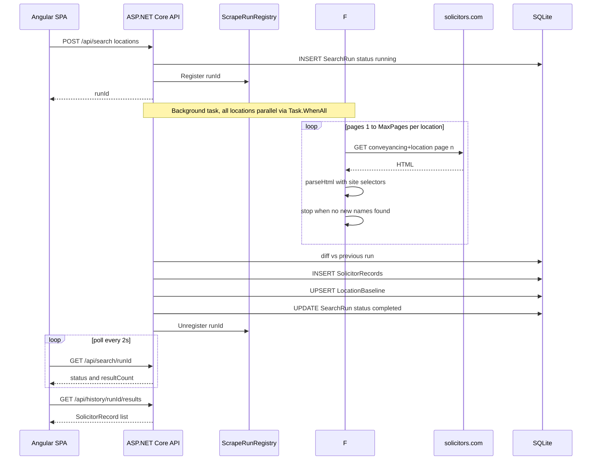
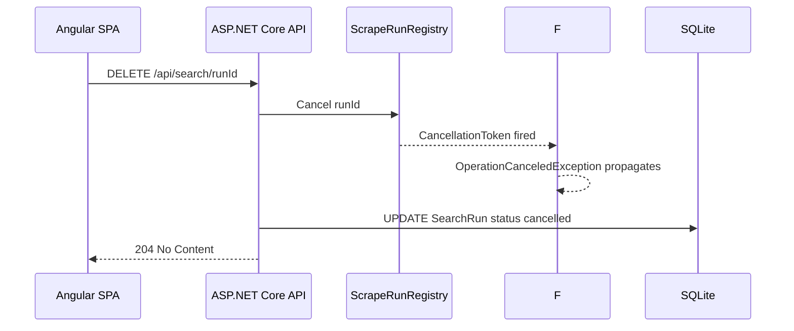
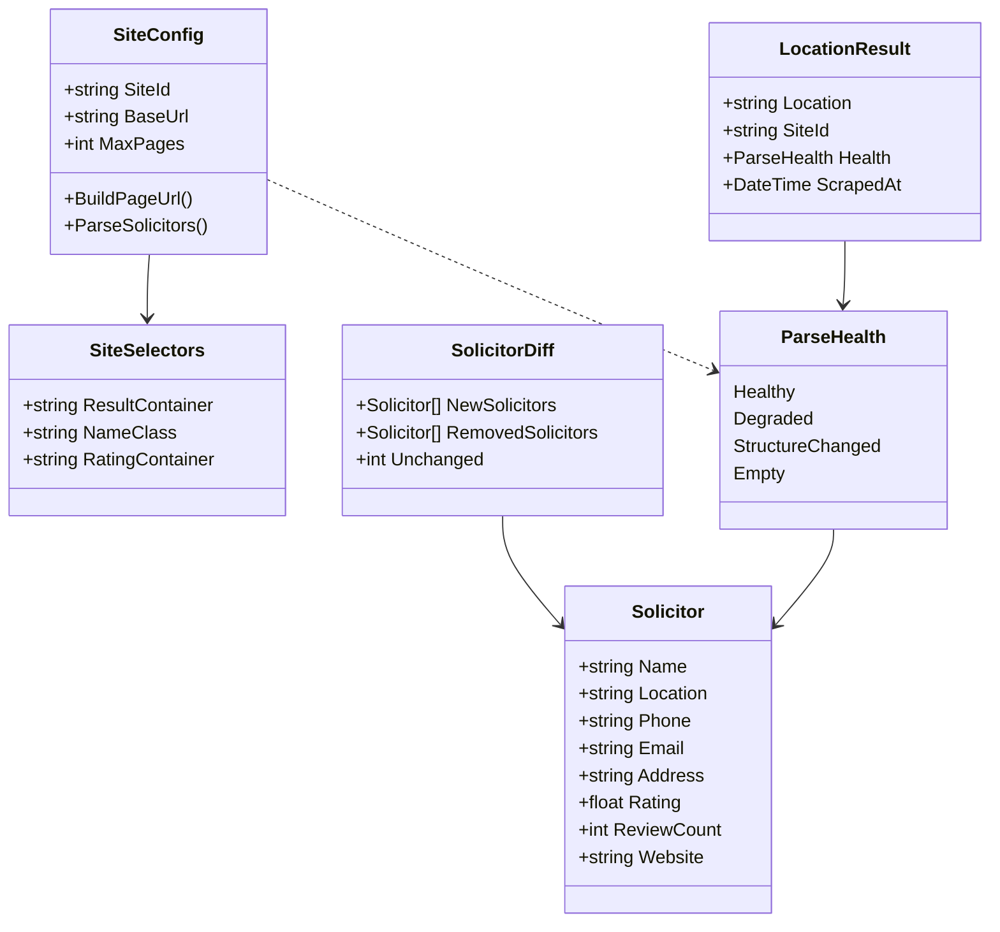

# InfoTrack Solicitor Scraper

F# + ASP.NET Core 10 scraper that finds conveyancing solicitors across UK locations in parallel, detects new entrants between runs, and surfaces results in an Angular 21 dashboard with live cancellation support.

## Why this architecture

The system is split into three deliberate layers:

- **F# scraper library** - pure domain logic: types, parsing, pagination, diffing. F# discriminated unions make every scrape outcome (`Healthy / Degraded / StructureChanged / Empty`) explicit and exhaustively checked at compile time. The railway-oriented pipeline (`Result`) eliminates scattered try/catch and makes failure paths as visible as the happy path. Parallel execution is a one-liner via `Task.WhenAll`.
- **C# API** - orchestration and persistence. ASP.NET Core is the right tool for HTTP routing, EF Core, DI lifetimes, and background task management. It calls into the F# library through straightforward interop.
- **Angular SPA** - thin client that polls for run status, renders filterable results, and surfaces health warnings per location.

The boundary between F# and C# is intentional: functional code handles what benefits most from immutability and algebraic types; the imperative shell handles I/O, DI, and infrastructure.

## Why F#

In most teams F# is ruled out before the conversation starts - unfamiliarity, hiring risk, onboarding cost. This project has none of those constraints, so the technically correct choice was made. Discriminated unions, pattern matching exhaustiveness, and the `Result` type solve real problems here (representing parse health, propagating cancellation, detecting selector staleness) without workarounds. The scraper core is ~150 lines with no nulls, no inheritance, and no mutable state.

- Also it is pure flex as most .Net developers have no clue about functional programming and even F# at all.
---

## Quick Start

```bash
git clone <repo>
cd InfoTrack
docker-compose up --build
# Open http://localhost:3000
```

---

## Architecture



### Scrape flow



### Cancel flow



### Domain model



---

## Tech stack

| Layer | Technology |
|---|---|
| Frontend | Angular 21, Angular Material v21, Chart.js + ng2-charts |
| API | ASP.NET Core 10 (C#), EF Core 10, Scalar API reference |
| Scraper | F# (.NET 10), `System.Text.RegularExpressions` |
| Persistence | SQLite (EF Core `EnsureCreated`) |
| Hosting | Docker Compose - nginx, api, db-data volume |

---

## Project structure

```
InfoTrack/
├── docker-compose.yml
├── src/
│   ├── InfoTrack.Scraper/          # F# - domain types, parser, pipeline
│   │   ├── Types.fs                # Solicitor, ParseHealth DU, SiteSelectors, SiteConfig, LocationResult
│   │   ├── Parser.fs               # Regex HTML extraction (parameterised by SiteSelectors)
│   │   ├── Pipeline.fs             # Parallel scrape loop (Task.WhenAll), pagination, diff
│   │   └── Sites/
│   │       └── SolicitorsCom.fs    # solicitors.com SiteConfig + selectors
│   │
│   ├── InfoTrack.Api/              # C# - Web API, EF Core, orchestration
│   │   ├── Program.cs
│   │   ├── Controllers/
│   │   │   ├── SearchController.cs
│   │   │   ├── HistoryController.cs
│   │   │   └── LocationsController.cs
│   │   ├── Services/
│   │   │   ├── ScraperOrchestrator.cs   # scoped - orchestrates scrape per request
│   │   │   ├── ScrapeRunRegistry.cs     # singleton - tracks CancellationTokenSource per runId
│   │   │   └── FSharpInterop.cs
│   │   ├── Data/
│   │   │   └── AppDbContext.cs
│   │   ├── Models/                 # EF entities: SearchRun, SolicitorRecord, LocationBaseline
│   │   └── Dockerfile
│   │
│   └── InfoTrack.Web/              # Angular 21 SPA
│       ├── src/app/
│       │   ├── features/
│       │   │   ├── search/         # Location chips, Run Scrape, Cancel, polling
│       │   │   ├── results/        # Filterable table + bar chart, health banners
│       │   │   └── history/        # Past runs list
│       │   └── core/services/      # SearchService, HistoryService, LocationService
│       ├── Dockerfile
│       └── nginx.conf
```

---

## Key design decisions

- **Discriminated unions** - `ParseHealth` (Healthy/Degraded/StructureChanged/Empty) makes every scrape outcome explicit and exhaustively checked at compile time. Silent empty results are impossible.
- **Railway Oriented Programming** - errors propagate through `fetchHtml → ParseSolicitors` via `Result` without scattered try/catch. The pipeline always returns a `LocationResult`, even on failure.
- **Site-owned selectors** - each `SiteConfig` carries its own `SiteSelectors` record. The parser is parameterised; adding a new site only requires a new `SiteConfig` with its own selector values.
- **Parallel scraping** - `scrapeAllLocationsAsync` fans out all locations via `Task.WhenAll`. `HttpClient` is thread-safe; each location scrapes independently at full speed.
- **Cancellation** - `ScrapeRunRegistry` (singleton) holds a `CancellationTokenSource` per active run. `DELETE /api/search/{runId}` cancels the token; `OperationCanceledException` propagates through the F# pipeline and marks the run `cancelled`. `ScraperOrchestrator` stays scoped.
- **Plugin model** - adding a new site requires one new `SiteConfig` record; no pipeline changes needed.
- **Empty vs structure-changed** - a 404 or zero result blocks maps to `Empty` (location genuinely has no listings); `StructureChanged` is reserved for cases where blocks exist but names cannot be extracted (selector staleness).
- **SQLite** - zero-config persistence, runs inside the API container with a named Docker volume.
- **No third-party HTML parsers** - `System.Text.RegularExpressions` only.
- **Fire-and-forget scraping** - `POST /api/search` returns a `runId` immediately; the client polls `GET /api/search/{runId}` every 2s.

---

## API endpoints

| Method | Path | Description |
|---|---|---|
| POST | `/api/search` | Start a scrape run; returns `{ runId }` |
| GET | `/api/search/{runId}` | Poll run status and result count |
| DELETE | `/api/search/{runId}` | Cancel a running scrape |
| GET | `/api/history` | Last 20 runs |
| GET | `/api/history/{runId}/results` | All solicitors for a run (filter/sort via query params) |
| GET | `/api/history/{runId}/summary` | Per-location aggregates including zero-result locations |
| GET | `/api/locations` | Default location list |

Interactive docs: `http://localhost:5000/scalar` (local) or `http://localhost:3000/scalar` (Docker via nginx proxy).

---

## Local development (without Docker)

```bash
# API
cd src/InfoTrack.Api
dotnet run
# → http://localhost:5000

# Angular (separate terminal)
cd src/InfoTrack.Web
npm install
npm start   # proxies /api → http://localhost:5000
# → http://localhost:4200
```

---

## Configuration

| Variable | Default | Purpose |
|---|---|---|
| `ConnectionStrings__Default` | `Data Source=infotrack.db` | SQLite file path |
| `AllowedOrigins` | `http://localhost:4200,http://localhost:3000` | CORS allowed origins |

---

## Site selectors (solicitors.com)

Defined in `Sites/SolicitorsCom.fs`. Verified against `https://www.solicitors.com/conveyancing+london.html` on 2026-03-12:

| Field | Extraction |
|---|---|
| Card container | `div.result-item` |
| Firm name | `span.h2` - first text node before `.greentick` child |
| Phone | `a[href^="tel:"]` inside `div.phone-block` |
| Address | `<address>` element |
| Rating | Count `div.star-full` (×1.0) + `div.star-half` (×0.5) inside `span.rev-results` |
| Review count | `(N)` text node inside `span.rev-results` |
| Website | `a[rel="nofollow"]` with globe icon |
| Email | Not exposed - site uses an enquiry form |

---

## robots.txt

`robots.txt` on the https://www.solicitors.com/ had only site map no specific instructions nor T&Cs

## Agent used

I used Cluade Code with model Sonnet 4.6 as coding agent.
